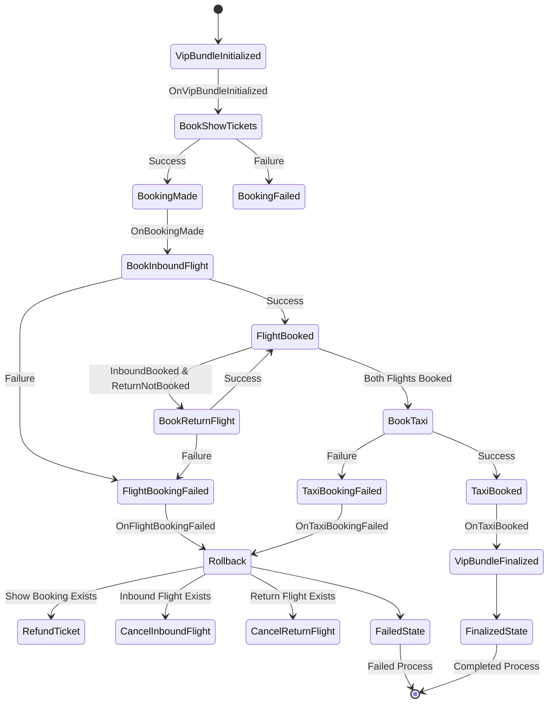

# Failed to Book Taxi

The last piece of the puzzle is to handle taxi booking failure.

As with the flight bookings, the taxi service will now return HTTP 409.

## Exercise

File: `project/main.go`

All that we need to do here is to publish the `TaxiBookingFailed_v1` event.
It should be handled by our process manager, and all operations should be rolled back.
