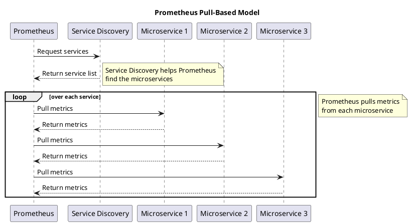

# Processing Metrics

We'll start with some metrics that count how many events are processed and how often the processing fails.

Some message brokers expose some metrics out of the box, while for others, there are tools that can export them for you.
Unfortunately, metrics that are exported out of the box are often not enough or don't provide enough context.
Fortunately, it's not that hard to export metrics ourselves.

We will use Prometheus to export metrics. 
This is currently an industry standard for storing metrics and does the job very well.


<div class="alert alert-dismissible bg-light-primary d-flex flex-column flex-sm-row p-7 mb-10">
    <div class="d-flex flex-column">
        <h3 class="mb-5 text-dark">
			<svg xmlns="http://www.w3.org/2000/svg" width="16" height="16" fill="currentColor" class="bi bi-lightbulb text-primary" viewBox="0 0 16 16">
			  <path d="M2 6a6 6 0 1 1 10.174 4.31c-.203.196-.359.4-.453.619l-.762 1.769A.5.5 0 0 1 10.5 13a.5.5 0 0 1 0 1 .5.5 0 0 1 0 1l-.224.447a1 1 0 0 1-.894.553H6.618a1 1 0 0 1-.894-.553L5.5 15a.5.5 0 0 1 0-1 .5.5 0 0 1 0-1 .5.5 0 0 1-.46-.302l-.761-1.77a1.964 1.964 0 0 0-.453-.618A5.984 5.984 0 0 1 2 6zm6-5a5 5 0 0 0-3.479 8.592c.263.254.514.564.676.941L5.83 12h4.342l.632-1.467c.162-.377.413-.687.676-.941A5 5 0 0 0 8 1z"/>
			</svg>
			Tip
		</h3>
        <span>

If you are using different technologies to store metrics in your company — no worries!
These examples will be pretty generic, and you should be able to adapt them easily to any metrics database.

</span>
	</div>
	</div>


### Prometheus

Prometheus is an open-source, pull-based monitoring system.
Because it is pull-based, your service is not pushing metrics to some endpoint; instead, Prometheus is pulling them from the service's endpoint.



In pull-based systems, your service is responsible for initial metrics aggregation and exposing them on some endpoint.
You can easily debug such a service with `curl [host:port]/metrics` and see if it works.
The response from the endpoint looks more or less like:

```text
# HELP http_requests_total The total number of HTTP requests.
# TYPE http_requests_total counter
http_requests_total{method="post",code="200"} 1027
http_requests_total{method="post",code="400"} 3

# HELP http_request_duration_seconds A histogram of request duration.
# TYPE http_request_duration_seconds histogram
http_request_duration_seconds_bucket{le="0.05"} 1000
http_request_duration_seconds_bucket{le="0.1"} 1500
http_request_duration_seconds_bucket{le="0.2"} 2000
http_request_duration_seconds_bucket{le="0.5"} 2500
http_request_duration_seconds_bucket{le="1"} 3000
http_request_duration_seconds_bucket{le="+Inf"} 3500
http_request_duration_seconds_sum 5000
http_request_duration_seconds_count 3500
```

This approach has some advantages:
- It's more efficient at scale.
- It's easier to scale scraping with multiple Prometheus instances.
- It's easier to debug — you can just make HTTP requests to the `/metrics` endpoint and see if it works.
- It's more fault-tolerant — if Prometheus is down for a while, your services will not notice it.

The disadvantage of this approach may be the potential loss of some metrics if your service goes down before
being scraped by Prometheus.
Because of that, Prometheus should be not used in cases when very accurate metric values are required (e.g., for billing).
Fortunately, it's good enough for observability, and it's a fair trade-off for the advantages it provides.

There are multiple Prometheus backend implementations: [Prometheus](https://prometheus.io), [Thanos](https://thanos.io), or hosted solutions.


<div class="alert alert-dismissible bg-light-primary d-flex flex-column flex-sm-row p-7 mb-10">
    <div class="d-flex flex-column">
        <h3 class="mb-5 text-dark">
			<svg xmlns="http://www.w3.org/2000/svg" width="16" height="16" fill="currentColor" class="bi bi-lightbulb text-primary" viewBox="0 0 16 16">
			  <path d="M2 6a6 6 0 1 1 10.174 4.31c-.203.196-.359.4-.453.619l-.762 1.769A.5.5 0 0 1 10.5 13a.5.5 0 0 1 0 1 .5.5 0 0 1 0 1l-.224.447a1 1 0 0 1-.894.553H6.618a1 1 0 0 1-.894-.553L5.5 15a.5.5 0 0 1 0-1 .5.5 0 0 1 0-1 .5.5 0 0 1-.46-.302l-.761-1.77a1.964 1.964 0 0 0-.453-.618A5.984 5.984 0 0 1 2 6zm6-5a5 5 0 0 0-3.479 8.592c.263.254.514.564.676.941L5.83 12h4.342l.632-1.467c.162-.377.413-.687.676-.941A5 5 0 0 0 8 1z"/>
			</svg>
			Tip
		</h3>
        <span>

It's also possible to use Prometheus in a push-based model.
You can learn more in the [official documentation](https://prometheus.io/docs/practices/pushing/).

</span>
	</div>
	</div>

### Using Prometheus

You don't need to implement the `/metrics` endpoint by yourself; there are [libraries for multiple languages](https://prometheus.io/docs/instrumenting/clientlibs/) that can help you with that.
They are capable of making the initial aggregation of metrics and exposing them in Prometheus format.
There is also a detailed guide for how to [do this for Go](https://prometheus.io/docs/guides/go-application/).
No worries, though, we'll do it together!

The Go library will generate some extra metrics about the Go process as well:

```text
# TYPE go_gc_duration_seconds summary
go_gc_duration_seconds{quantile="0"} 0.000269959
go_gc_duration_seconds{quantile="0.25"} 0.000403833
go_gc_duration_seconds{quantile="0.5"} 0.000451583
go_gc_duration_seconds{quantile="0.75"} 0.001240209
go_gc_duration_seconds{quantile="1"} 0.0039475
go_gc_duration_seconds_sum 0.006313084
go_gc_duration_seconds_count 5
# HELP go_goroutines Number of goroutines that currently exist.
# TYPE go_goroutines gauge
go_goroutines 60215
# HELP go_info Information about the Go environment.
# TYPE go_info gauge
go_info{version="go1.20.5"} 1
# HELP go_memstats_alloc_bytes Number of bytes allocated and still in use.
# TYPE go_memstats_alloc_bytes gauge
go_memstats_alloc_bytes 3.296564e+07
```

### Metric types

Prometheus supports multiple metric types:

- **Counter**: Can be only increased or zeroed; good for representing numbers of requests, errors, or other events.
- **Gauge**: Can go up or down; good for representing the current state of something, like the number of active connections, memory usage, etc.
- **Histogram**: Counts the number of events that happened in a given time period; good for representing request duration, response size, etc.
- **Summary**: Similar to histogram but also calculates configurable quantiles; good for representing request duration, response size, etc.

To learn more about these, check the [Prometheus documentation](https://prometheus.io/docs/concepts/metric_types/).

### Metric names and labels

Each metric is identified by its name and label. For example:

```text
http_requests_total{method="post",code="200"} 1027
```

This is a metric with the name `http_requests_total`, labels `method` and `code`, and value `1027`.

Having labels in metrics allows you to aggregate them in different ways.
For example, you can calculate the total count of `POST` requests.
It's also possible to calculate a count of all requests.
Without labels, we would lose that information.


<div class="alert alert-dismissible bg-light-primary d-flex flex-column flex-sm-row p-7 mb-10">
    <div class="d-flex flex-column">
        <h3 class="mb-5 text-dark">
			<svg xmlns="http://www.w3.org/2000/svg" width="16" height="16" fill="currentColor" class="bi bi-lightbulb text-primary" viewBox="0 0 16 16">
			  <path d="M2 6a6 6 0 1 1 10.174 4.31c-.203.196-.359.4-.453.619l-.762 1.769A.5.5 0 0 1 10.5 13a.5.5 0 0 1 0 1 .5.5 0 0 1 0 1l-.224.447a1 1 0 0 1-.894.553H6.618a1 1 0 0 1-.894-.553L5.5 15a.5.5 0 0 1 0-1 .5.5 0 0 1 0-1 .5.5 0 0 1-.46-.302l-.761-1.77a1.964 1.964 0 0 0-.453-.618A5.984 5.984 0 0 1 2 6zm6-5a5 5 0 0 0-3.479 8.592c.263.254.514.564.676.941L5.83 12h4.342l.632-1.467c.162-.377.413-.687.676-.941A5 5 0 0 0 8 1z"/>
			</svg>
			Tip
		</h3>
        <span>

Avoid high-cardinality labels — in other words, labels with too many values —
because that can lead to high memory usage and performance issues.

Having a separate metric for each user ID or error type could generate a lot of metrics at bigger scale.
Each of them will also need to be stored in your service's memory and in Prometheus' memory as well — this won't scale well.

</span>
	</div>
	</div>

Prometheus metrics names have a specific naming convention. This convention is not enforced, but it's recommended to follow it.
The single-word prefix of the metrics should represent the service or domain to which it belongs to.

For example, if you have a metric specific to a `tickets` service, it should have the prefix `tickets_`.
If you have a more general metric that is not specific to any service, it can have a prefix related to its domain, like  `http`, `messages`, etc.


The suffix of the metric should describe the unit of the metric in plural form.
For example: `seconds`, `bytes`, `requests`, `seconds_total`, `total`, etc.

You can learn more about the naming in the [Prometheus "naming" documentation](https://prometheus.io/docs/practices/naming/).


## Plotting charts

Prometheus has a built-in charting tool, but it's not the best.
We recommend using [Grafana](https://prometheus.io/docs/visualization/grafana/) for that.

## Exercise

File: `project/main.go`

Let's add a simple Prometheus metric to our application.

We'll add the `tickets_very_important_counter_total` metric (which is specific to our `tickets` service) and increment it each second.

To expose the metrics, we'll use the official Prometheus library [`github.com/prometheus/client_golang/prometheus/promhttp`](https://github.com/prometheus/client_golang/prometheus/promhttp). 

To make it work, we need to follow three steps:

1. Register the HTTP metric handler in our router in the `/metrics` path.
2. Create a metric.
3. Increase the metric value in the goroutine.

To register the HTTP metric handler, we need to add the following code to our HTTP router.
For simplicity, we will add it to the main HTTP router.


<div class="alert alert-dismissible bg-light-primary d-flex flex-column flex-sm-row p-7 mb-10">
    <div class="d-flex flex-column">
        <h3 class="mb-5 text-dark">
			<svg xmlns="http://www.w3.org/2000/svg" width="16" height="16" fill="currentColor" class="bi bi-lightbulb text-primary" viewBox="0 0 16 16">
			  <path d="M2 6a6 6 0 1 1 10.174 4.31c-.203.196-.359.4-.453.619l-.762 1.769A.5.5 0 0 1 10.5 13a.5.5 0 0 1 0 1 .5.5 0 0 1 0 1l-.224.447a1 1 0 0 1-.894.553H6.618a1 1 0 0 1-.894-.553L5.5 15a.5.5 0 0 1 0-1 .5.5 0 0 1 0-1 .5.5 0 0 1-.46-.302l-.761-1.77a1.964 1.964 0 0 0-.453-.618A5.984 5.984 0 0 1 2 6zm6-5a5 5 0 0 0-3.479 8.592c.263.254.514.564.676.941L5.83 12h4.342l.632-1.467c.162-.377.413-.687.676-.941A5 5 0 0 0 8 1z"/>
			</svg>
			Tip
		</h3>
        <span>

Normally, you might like to expose your metrics on a different port, so you can ensure that they are not publicly accessible.

If that's not an option, you can always add some form of authentication to the endpoint, such as [Basic Auth](https://prometheus.io/docs/guides/basic-auth/).

</span>
	</div>
	</div>

```go
import (
    "github.com/labstack/echo/v4"
    "github.com/prometheus/client_golang/prometheus/promhttp"
)

// ...

e.GET("/metrics", echo.WrapHandler(promhttp.Handler()))
```


<div class="alert alert-dismissible bg-light-primary d-flex flex-column flex-sm-row p-7 mb-10">
    <div class="d-flex flex-column">
        <h3 class="mb-5 text-dark">
			<svg xmlns="http://www.w3.org/2000/svg" width="16" height="16" fill="currentColor" class="bi bi-lightbulb text-primary" viewBox="0 0 16 16">
			  <path d="M2 6a6 6 0 1 1 10.174 4.31c-.203.196-.359.4-.453.619l-.762 1.769A.5.5 0 0 1 10.5 13a.5.5 0 0 1 0 1 .5.5 0 0 1 0 1l-.224.447a1 1 0 0 1-.894.553H6.618a1 1 0 0 1-.894-.553L5.5 15a.5.5 0 0 1 0-1 .5.5 0 0 1 0-1 .5.5 0 0 1-.46-.302l-.761-1.77a1.964 1.964 0 0 0-.453-.618A5.984 5.984 0 0 1 2 6zm6-5a5 5 0 0 0-3.479 8.592c.263.254.514.564.676.941L5.83 12h4.342l.632-1.467c.162-.377.413-.687.676-.941A5 5 0 0 0 8 1z"/>
			</svg>
			Tip
		</h3>
        <span>

The Prometheus handler is implemented in HTTP standard library format. 
If you are using echo, you need to wrap it with `echo.WrapHandler`.

</span>
	</div>
	</div>


Next, we need to register a metric in a package in which we want to record the metric.
In this example, it doesn't matter where you put it — we did it in a package where we are managing the service lifecycle.
It can be done in an ugly way for now since we'll remove it later anyway.


```go
import (
    "github.com/prometheus/client_golang/prometheus"
    "github.com/prometheus/client_golang/prometheus/promauto"
)

// ...

var (
	veryImportantCounter = promauto.NewCounter(prometheus.CounterOpts{
		// metric will be named tickets_very_important_counter_total
		Namespace: "tickets",
		Name:      "very_important_counter_total",
		Help:      "Total number of very important things processed",
	})
)
```


<div class="alert alert-dismissible bg-light-primary d-flex flex-column flex-sm-row p-7 mb-10">
    <div class="d-flex flex-column">
        <h3 class="mb-5 text-dark">
			<svg xmlns="http://www.w3.org/2000/svg" width="16" height="16" fill="currentColor" class="bi bi-lightbulb text-primary" viewBox="0 0 16 16">
			  <path d="M2 6a6 6 0 1 1 10.174 4.31c-.203.196-.359.4-.453.619l-.762 1.769A.5.5 0 0 1 10.5 13a.5.5 0 0 1 0 1 .5.5 0 0 1 0 1l-.224.447a1 1 0 0 1-.894.553H6.618a1 1 0 0 1-.894-.553L5.5 15a.5.5 0 0 1 0-1 .5.5 0 0 1 0-1 .5.5 0 0 1-.46-.302l-.761-1.77a1.964 1.964 0 0 0-.453-.618A5.984 5.984 0 0 1 2 6zm6-5a5 5 0 0 0-3.479 8.592c.263.254.514.564.676.941L5.83 12h4.342l.632-1.467c.162-.377.413-.687.676-.941A5 5 0 0 0 8 1z"/>
			</svg>
			Tip
		</h3>
        <span>

You may notice that we are using global state here.
Isn't it the case that we should avoid doing so?

In most cases, using global state is not a good idea, but in this case, it's fine.
Metrics are transparent for the application, and injecting them to each function 
will only make the code more complex without any benefits.

</span>
	</div>
	</div>

Finally, we need to increase our metric in a goroutine.

```go
go func() {
    for {
        veryImportantCounter.Inc()
        time.Sleep(time.Millisecond * 100)
    }
}()
```

If you will [run your service locally](/trainings/go-event-driven/exercise/2e6ab18c-2490-479d-a5f1-7f2424c5fa98), you can test with curl: `curl http://localhost:8080/metrics`.

We will also check this metric during exercise verification.

We also have added Prometheus in your docker-compose and Grafana to browse metrics.
You can access Prometheus on http://localhost:9090 and Grafana on http://localhost:3000.
The default credentials for Grafana are `admin`/`admin`.

If you want, you can play for a while and experiment with creating some charts in Grafana.


<div class="alert alert-dismissible bg-light-primary d-flex flex-column flex-sm-row p-7 mb-10">
    <div class="d-flex flex-column">
        <h3 class="mb-5 text-dark">
			<svg xmlns="http://www.w3.org/2000/svg" width="16" height="16" fill="currentColor" class="bi bi-lightbulb text-primary" viewBox="0 0 16 16">
			  <path d="M2 6a6 6 0 1 1 10.174 4.31c-.203.196-.359.4-.453.619l-.762 1.769A.5.5 0 0 1 10.5 13a.5.5 0 0 1 0 1 .5.5 0 0 1 0 1l-.224.447a1 1 0 0 1-.894.553H6.618a1 1 0 0 1-.894-.553L5.5 15a.5.5 0 0 1 0-1 .5.5 0 0 1 0-1 .5.5 0 0 1-.46-.302l-.761-1.77a1.964 1.964 0 0 0-.453-.618A5.984 5.984 0 0 1 2 6zm6-5a5 5 0 0 0-3.479 8.592c.263.254.514.564.676.941L5.83 12h4.342l.632-1.467c.162-.377.413-.687.676-.941A5 5 0 0 0 8 1z"/>
			</svg>
			Tip
		</h3>
        <span>

If you don't have Docker installed on your machine, you can download it [here](https://www.docker.com/products/docker-desktop/).

</span>
	</div>
	</div>
