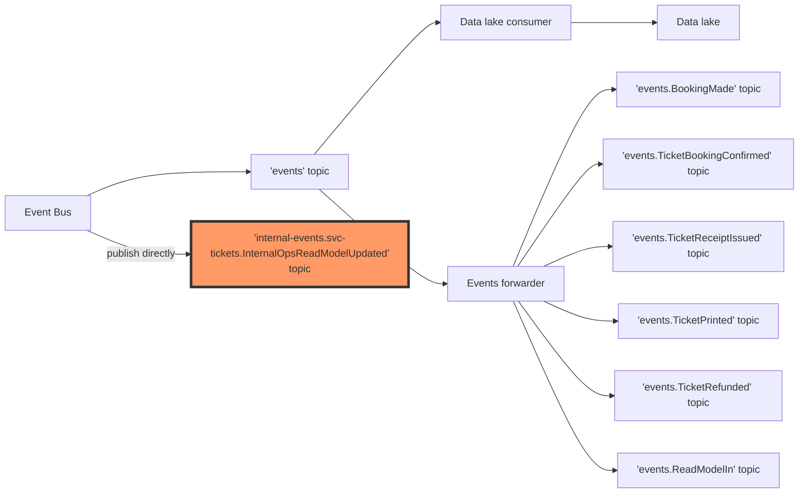

# Internal Events

You may be afraid to publish any new events after reading so much about backward compatibility.
However, there is one strategy that allows us to publish events without the need for any backward compatibility guarantees:
We can introduce internal events to our system.

Internal events are ones that should be just used by one service or one team.
They should be not published to the data lake (or, at least, not considered part of the contract).
Thanks to that, they don't need any backward compatibility guarantees.
You can change them without fear that you will break any other service.
You can think about them as a way of encapsulation (like public/private methods).

There are multiple ways of naming them; in most sources you can find the following:
- For internal: private
- For external: public, integration

## When to Use Internal Events

There is no simple answer here.
On the one hand, if you are using internal events, you are making your external contract smaller.
On the other hand, you are exposing less information about your system to other teams for integration or data analytics.
**It's a tradeoff, and you need to decide if this event may change and whether it may be useful for other teams.**

Internal events may be also a good choice for a very technical events that are not related to the domain.

If you are not sure, you can always start with an internal event and expose it later.

## Exercise

File: `project/main.go`

There is no single way of implementing internal events.
We will show you how we do it in our projects.

A good example of an internal event might be `InternalOpsReadModelUpdated`.
Nobody else should depend on that event, which is also very technical. 
The contract may also change with time, depending on what use cases you want to support.

This event could be used for sending SSE updates to the frontend.


<div class="alert alert-dismissible bg-light-primary d-flex flex-column flex-sm-row p-7 mb-10">
    <div class="d-flex flex-column">
        <h3 class="mb-5 text-dark">
			<svg xmlns="http://www.w3.org/2000/svg" width="16" height="16" fill="currentColor" class="bi bi-lightbulb text-primary" viewBox="0 0 16 16">
			  <path d="M2 6a6 6 0 1 1 10.174 4.31c-.203.196-.359.4-.453.619l-.762 1.769A.5.5 0 0 1 10.5 13a.5.5 0 0 1 0 1 .5.5 0 0 1 0 1l-.224.447a1 1 0 0 1-.894.553H6.618a1 1 0 0 1-.894-.553L5.5 15a.5.5 0 0 1 0-1 .5.5 0 0 1 0-1 .5.5 0 0 1-.46-.302l-.761-1.77a1.964 1.964 0 0 0-.453-.618A5.984 5.984 0 0 1 2 6zm6-5a5 5 0 0 0-3.479 8.592c.263.254.514.564.676.941L5.83 12h4.342l.632-1.467c.162-.377.413-.687.676-.941A5 5 0 0 0 8 1z"/>
			</svg>
			Tip
		</h3>
        <span>

Server-sent events (SSE) are out of the scope of this training, but Watermill has support for them out of the box.
You can read more in the [Watermill SSE example](https://github.com/ThreeDotsLabs/watermill/tree/master/_examples/real-world-examples/server-sent-events).

</span>
	</div>
	</div>

Our event can be as simple as this:

```go
type InternalOpsReadModelUpdated struct {
	Header EventHeader `json:"header"`
	
	BookingID uuid.UUID `json:"booking_id"`
}
```

It should be emitted after each update of the read model. If we used SSE, it would send the update of the content to the frontend.

We don't need to use outbox here — it's not a disaster if this event is lost.
It will be also less expensive in terms of resources if we emit it directly to Redis Streams.

It would be good to have an explicit way to know if an event is internal or not.
Checking the prefix of the struct name doesn't sound explicit enough.
Instead, let's define the `Event` interface:

```go
type Event interface {
	IsInternal() bool
}
```

`InternalOpsReadModelUpdated` should return `true`:

```go
func (i InternalOpsReadModelUpdated) IsInternal() bool {
	return true
}
```

It should return `false` for all non-internal events.

We want to ensure that this event won't be sent to the data lake.
To do that, we can change the logic of the event bus so that it will publish internal events directly to the per-event topic.
For `InternalOpsReadModelUpdated`, it will be `internal-events.svc-tickets.InternalOpsReadModelUpdated`.



It will not go through the `events` topic, so it won't be stored to the data lake.


<div class="accordion" id="hints-accordion">

<div class="accordion-item">
	<h3 class="accordion-header" id="hints-accordion-header-1">
	<button class="accordion-button fs-4 fw-semibold collapsed" type="button" data-bs-toggle="collapse" data-bs-target="#hints-accordion-body-1" aria-expanded="false" aria-controls="hints-accordion">
		Hint #1
	</button>
	</h3>
	<div id="hints-accordion-body-1" class="accordion-collapse collapse" aria-labelledby="hints-accordion-header-1" data-bs-parent="#hints-accordion">
	<div class="accordion-body">

To change the topics used for publishing and subscribing, 
you need to adjust the [event bus](/trainings/go-event-driven/exercise/4c908a02-a3e9-4a20-ad09-20a511c1c912) config and [event processor](/trainings/go-event-driven/exercise/7d5d32c0-772e-48f3-82a9-087a49e73931) config.
Both of them have access to the published and subscribed events.

```go
cqrs.EventBusConfig{
     GeneratePublishTopic: func(params cqrs.GenerateEventPublishTopicParams) (string, error) {
         event, ok := params.Event.(entities.Event)
         if !ok {
             return "", fmt.Errorf("invalid event type: %T doesn't implement entities.Event", params.Event)
         }

         if event.IsInternal() {
             // Publish directly to the per-event topic
             return "internal-events.svc-tickets." + params.EventName, nil
         } else {
             // Publish to the "events" topic, so it will be stored to the data lake and forwarded to the
             // per-event topic
             return "events", nil
         }
     }
```

```go
return cqrs.EventProcessorConfig{
     GenerateSubscribeTopic: func(params cqrs.EventProcessorGenerateSubscribeTopicParams) (string, error) {
         handlerEvent := params.EventHandler.NewEvent()
         event, ok := handlerEvent.(entities.Event)
         if !ok {
             return "", fmt.Errorf("invalid event type: %T doesn't implement entities.Event", handlerEvent)
         }

         var prefix string
         if event.IsInternal() {
             prefix = "internal-events.svc-tickets."
         } else {
             prefix = "events."
         }

         return fmt.Sprintf(prefix + params.EventName), nil
     },
```

</div>
	</div>
	</div>

<div class="accordion-item">
	<h3 class="accordion-header" id="hints-accordion-header-2">
	<button class="accordion-button fs-4 fw-semibold collapsed" type="button" data-bs-toggle="collapse" data-bs-target="#hints-accordion-body-2" aria-expanded="false" aria-controls="hints-accordion">
		Hint #2
	</button>
	</h3>
	<div id="hints-accordion-body-2" class="accordion-collapse collapse" aria-labelledby="hints-accordion-header-2" data-bs-parent="#hints-accordion">
	<div class="accordion-body">

How do you publish an event when the read model is updated? Just inject the event bus to the read model and publish the event.

```go
    // ...
	
			return r.updateReadModel(ctx, tx, updatedRm)
		},
	); err != nil {
		return err
	}

	return r.eventBus.Publish(ctx, &entities.InternalOpsReadModelUpdated{
		Header:    entities.NewEventHeader(),
		BookingID: uuid.MustParse(bookingID),
	})
}
```

</div>
	</div>
	</div>

</div>
