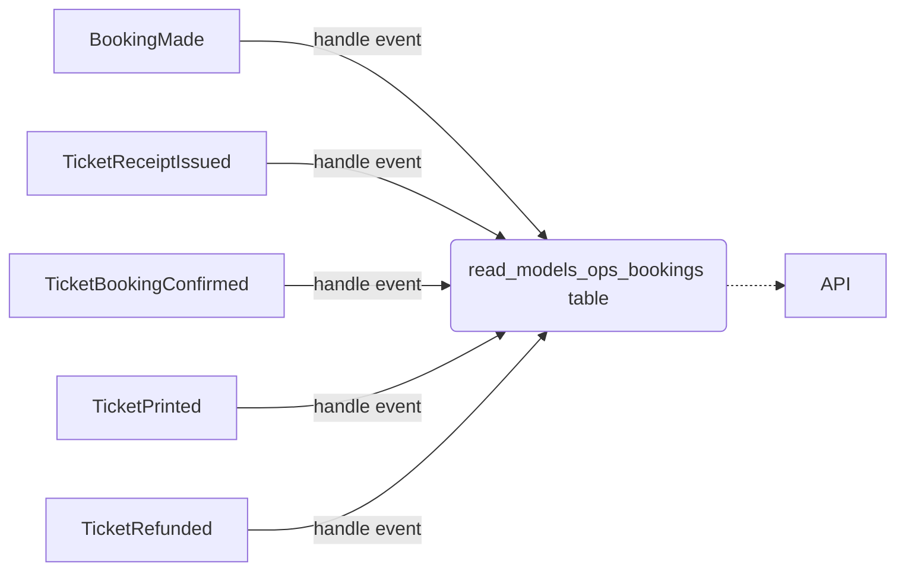

# Project: Storing the Read Model

## Building the Read Model

We prepared a structure that you can use for building the read model.
This is the format of the response that you should return from the API.

```go
type OpsBooking struct {
	BookingID uuid.UUID `json:"booking_id"`
	BookedAt  time.Time `json:"booked_at"`

	Tickets map[string]OpsTicket `json:"tickets"`

	LastUpdate time.Time `json:"last_update"`
}

type OpsTicket struct {
	PriceAmount   string `json:"price_amount"`
	PriceCurrency string `json:"price_currency"`
	CustomerEmail string `json:"customer_email"`
	
	// Status should be set to "confirmed" or "refunded"
	Status string `json:"status"`
	
	PrintedAt       time.Time `json:"printed_at"`
	PrintedFileName string    `json:"printed_file_name"`

	ReceiptIssuedAt time.Time `json:"receipt_issued_at"`
	ReceiptNumber   string    `json:"receipt_number"`
}
```

All the needed data is available in already existing events.

Note that our "core" model is the booking, and we keep multiple tickets inside it.

Now it's your turn to implement the logic of storing the read model.
You should store your read model in the `read_model_ops_bookings` table, so we can verify your solution.


<div class="alert alert-dismissible bg-light-primary d-flex flex-column flex-sm-row p-7 mb-10">
    <div class="d-flex flex-column">
        <h3 class="mb-5 text-dark">
			<svg xmlns="http://www.w3.org/2000/svg" width="16" height="16" fill="currentColor" class="bi bi-lightbulb text-primary" viewBox="0 0 16 16">
			  <path d="M2 6a6 6 0 1 1 10.174 4.31c-.203.196-.359.4-.453.619l-.762 1.769A.5.5 0 0 1 10.5 13a.5.5 0 0 1 0 1 .5.5 0 0 1 0 1l-.224.447a1 1 0 0 1-.894.553H6.618a1 1 0 0 1-.894-.553L5.5 15a.5.5 0 0 1 0-1 .5.5 0 0 1 0-1 .5.5 0 0 1-.46-.302l-.761-1.77a1.964 1.964 0 0 0-.453-.618A5.984 5.984 0 0 1 2 6zm6-5a5 5 0 0 0-3.479 8.592c.263.254.514.564.676.941L5.83 12h4.342l.632-1.467c.162-.377.413-.687.676-.941A5 5 0 0 0 8 1z"/>
			</svg>
			Tip
		</h3>
        <span>

It's good to have a prefix for read model tables, so you instantly know that this data is not the source of truth (write model) and is eventually consistent.
Nobody should accidentally write to the read model tables.

</span>
	</div>
	</div>

**You should store it in the database simply as a JSON.** It's not relational data - it's a projection of the write model.
Writing to multiple columns would add a lot of unnecessary overhead.
You should also not define any foreign keys - this data is eventually consistent, 
and you don't have a guarantee that constraints will be satisfied.
Also, often you may want to store this data in a different database (like Elasticsearch), so you won't be able to define any foreign keys.

We covered detailed reasoning for that in [the first exercise in this module](/trainings/go-event-driven/exercise/cc7047b9-4d4b-413e-abbc-cbe29a8cba9d).

```go
CREATE TABLE IF NOT EXISTS read_model_ops_bookings (
    booking_id UUID PRIMARY KEY,
    payload JSONB NOT NULL
);
```

## Implementation tips

#### Helpers

You will be updating the read model with multiple events.
It's useful to have some helpers that will help you avoid code duplication.

Some events are updating just the ticket within booking.
You should have a helper that hides that logic from you.

Like in [the first exercise in the module](/trainings/go-event-driven/exercise/cc7047b9-4d4b-413e-abbc-cbe29a8cba9d),
you can create an `OpsBookingReadModel` struct, that will have a method for each handled event.

```go
func (r OpsBookingReadModel) OnBookingMade(ctx context.Context, bookingMade *entities.BookingMade) error {
	readModel := // ...
	
	err := r.createReadModel(ctx, readModel)
	if err != nil {
		return fmt.Errorf("could not create read model: %w", err)
	}

	return nil
}

func (r OpsBookingReadModel) OnTicketBookingConfirmed(ctx context.Context, event *entities.TicketBookingConfirmed) error {
	return r.updateBookingReadModel(
		ctx,
		event.BookingID,
		func(rm entities.OpsBooking) (entities.OpsBooking, error) {
			ticket, ok := rm.Tickets[event.TicketID]
			if !ok {
				// we use the zero-value of OpsTicket
				log.
					FromContext(ctx).
					WithField("ticket_id", event.TicketID).
					Debug("Creating ticket read model for ticket %s")
			}

			// TODO: you should create ticket here and add it to booking
			rm.Tickets[event.TicketID] = ticket

			return rm, nil
		},
	)
}
```


<div class="alert alert-dismissible bg-light-primary d-flex flex-column flex-sm-row p-7 mb-10">
    <div class="d-flex flex-column">
        <h3 class="mb-5 text-dark">
			<svg xmlns="http://www.w3.org/2000/svg" width="16" height="16" fill="currentColor" class="bi bi-lightbulb text-primary" viewBox="0 0 16 16">
			  <path d="M2 6a6 6 0 1 1 10.174 4.31c-.203.196-.359.4-.453.619l-.762 1.769A.5.5 0 0 1 10.5 13a.5.5 0 0 1 0 1 .5.5 0 0 1 0 1l-.224.447a1 1 0 0 1-.894.553H6.618a1 1 0 0 1-.894-.553L5.5 15a.5.5 0 0 1 0-1 .5.5 0 0 1 0-1 .5.5 0 0 1-.46-.302l-.761-1.77a1.964 1.964 0 0 0-.453-.618A5.984 5.984 0 0 1 2 6zm6-5a5 5 0 0 0-3.479 8.592c.263.254.514.564.676.941L5.83 12h4.342l.632-1.467c.162-.377.413-.687.676-.941A5 5 0 0 0 8 1z"/>
			</svg>
			Tip
		</h3>
        <span>

Did you notice that `OnTicketBookingConfirmed` has signature compatible with `cqrs.NewEventHandler`?
It's fine to use it directly as event processor.

```go
cqrs.NewEventHandler(
	"ops_read_model.OnBookingMade",
	opsReadModel.OnBookingMade,
)
```

</span>
	</div>
	</div>

You can keep your `OpsBookingReadModel` close to repositories.


<div class="alert alert-dismissible bg-light-primary d-flex flex-column flex-sm-row p-7 mb-10">
    <div class="d-flex flex-column">
        <h3 class="mb-5 text-dark">
			<svg xmlns="http://www.w3.org/2000/svg" width="16" height="16" fill="currentColor" class="bi bi-lightbulb text-primary" viewBox="0 0 16 16">
			  <path d="M2 6a6 6 0 1 1 10.174 4.31c-.203.196-.359.4-.453.619l-.762 1.769A.5.5 0 0 1 10.5 13a.5.5 0 0 1 0 1 .5.5 0 0 1 0 1l-.224.447a1 1 0 0 1-.894.553H6.618a1 1 0 0 1-.894-.553L5.5 15a.5.5 0 0 1 0-1 .5.5 0 0 1 0-1 .5.5 0 0 1-.46-.302l-.761-1.77a1.964 1.964 0 0 0-.453-.618A5.984 5.984 0 0 1 2 6zm6-5a5 5 0 0 0-3.479 8.592c.263.254.514.564.676.941L5.83 12h4.342l.632-1.467c.162-.377.413-.687.676-.941A5 5 0 0 0 8 1z"/>
			</svg>
			Tip
		</h3>
        <span>

If you didn't implement the repository pattern yet, you should check out [our article about the repository pattern in Go](https://threedots.tech/post/repository-pattern-in-go/).

</span>
	</div>
	</div>

#### Handling transactions

It's useful to wrap database transactions in such functions:

```go
func updateInTx(
	ctx context.Context,
	db *sqlx.DB,
	isolation sql.IsolationLevel,
	fn func(ctx context.Context, tx *sqlx.Tx) error,
) (err error) {
	tx, err := db.BeginTxx(ctx, &sql.TxOptions{Isolation: isolation})
	if err != nil {
		return fmt.Errorf("could not begin transaction: %w", err)
	}

	defer func() {
		if err != nil {
			if rollbackErr := tx.Rollback(); rollbackErr != nil {
				err = errors.Join(err, rollbackErr)
			}
			return
		}

		err = tx.Commit()
	}()

	return fn(ctx, tx)
}
```


<div class="alert alert-dismissible bg-light-primary d-flex flex-column flex-sm-row p-7 mb-10">
    <div class="d-flex flex-column">
        <h3 class="mb-5 text-dark">
			<svg xmlns="http://www.w3.org/2000/svg" width="16" height="16" fill="currentColor" class="bi bi-lightbulb text-primary" viewBox="0 0 16 16">
			  <path d="M2 6a6 6 0 1 1 10.174 4.31c-.203.196-.359.4-.453.619l-.762 1.769A.5.5 0 0 1 10.5 13a.5.5 0 0 1 0 1 .5.5 0 0 1 0 1l-.224.447a1 1 0 0 1-.894.553H6.618a1 1 0 0 1-.894-.553L5.5 15a.5.5 0 0 1 0-1 .5.5 0 0 1 0-1 .5.5 0 0 1-.46-.302l-.761-1.77a1.964 1.964 0 0 0-.453-.618A5.984 5.984 0 0 1 2 6zm6-5a5 5 0 0 0-3.479 8.592c.263.254.514.564.676.941L5.83 12h4.342l.632-1.467c.162-.377.413-.687.676-.941A5 5 0 0 0 8 1z"/>
			</svg>
			Tip
		</h3>
        <span>

To ensure that you are not losing any updates due to concurrent writes,
you should use `sql.LevelRepeatableRead` isolation level for read model updates transaction.

If you want to learn more about isolation levels, check out this article about [Transaction Isolation Levels With PostgreSQL](https://mkdev.me/posts/transaction-isolation-levels-with-postgresql-as-an-example).

</span>
	</div>
	</div>

#### Out of order events

You may receive events out of order (it's theoretically possible to receive `TicketPrinted` before `TicketBookingConfirmed`).
In such scenario, you can return an error for the `TicketPrinted` (nack it), and wait for the `TicketBookingConfirmed` to arrive.
`TicketPrinted` will be delivered again, and you will be able to process it.

#### Testing

You can apply the same testing strategy like when 
[testing repositories](/trainings/go-event-driven/exercise/462e1ede-56d0-4aa0-ae2c-f51493606bcc).

## Exercise

File: `project/main.go`

Implement a read model with the provided structure and store it in the `read_model_ops_bookings` table.

To simplify your job a bit, this is the list of events that you need to listen for:
- `BookingMade`
- `TicketReceiptIssued`
- `TicketBookingConfirmed`
- `TicketPrinted`
- `TicketRefunded`




<div class="accordion" id="hints-accordion">

<div class="accordion-item">
	<h3 class="accordion-header" id="hints-accordion-header-2">
	<button class="accordion-button fs-4 fw-semibold collapsed" type="button" data-bs-toggle="collapse" data-bs-target="#hints-accordion-body-2" aria-expanded="false" aria-controls="hints-accordion">
		Hint #2
	</button>
	</h3>
	<div id="hints-accordion-body-2" class="accordion-collapse collapse" aria-labelledby="hints-accordion-header-2" data-bs-parent="#hints-accordion">
	<div class="accordion-body">

Some more helpers may be useful during implementation.
We recommend spending some effort trying to figure it out by yourself.

```go
func (r OpsBookingReadModel) createReadModel(
	ctx context.Context,
	booking entities.OpsBooking,
) (err error) {
	payload, err := json.Marshal(booking)
	if err != nil {
		return err
	}

	_, err = r.db.ExecContext(ctx, `
		INSERT INTO 
		    read_model_ops_bookings (payload, booking_id)
		VALUES
			($1, $2)
		ON CONFLICT (booking_id) DO NOTHING; -- read model may be already updated by another event - we don't want to override
`, payload, booking.BookingID)

	if err != nil {
		return fmt.Errorf("could not create read model: %w", err)
	}

	return nil
}

func (r OpsBookingReadModel) updateBookingReadModel(
	ctx context.Context,
	bookingID string,
	updateFunc func(ticket entities.OpsBooking) (entities.OpsBooking, error),
) (err error) {
	return updateInTx(
		ctx,
		r.db,
		sql.LevelRepeatableRead,
		func(ctx context.Context, tx *sqlx.Tx) error {
			rm, err := r.findReadModelByBookingID(ctx, bookingID, tx)
			if err == sql.ErrNoRows {
				// events arrived out of order - it should spin until the read model is created
				return fmt.Errorf("read model for booking %s not exist yet", bookingID)
			} else if err != nil {
				return fmt.Errorf("could not find read model: %w", err)
			}

			updatedRm, err := updateFunc(rm)
			if err != nil {
				return err
			}

			return r.updateReadModel(ctx, tx, updatedRm)
		},
	)
}

func (r OpsBookingReadModel) updateTicketInBookingReadModel(
	ctx context.Context,
	ticketID string,
	updateFunc func(ticket entities.OpsTicket) (entities.OpsTicket, error),
) (err error) {
	return updateInTx(
		ctx,
		r.db,
		sql.LevelRepeatableRead,
		func(ctx context.Context, tx *sqlx.Tx) error {
			rm, err := r.findReadModelByTicketID(ctx, ticketID, tx)
			if err == sql.ErrNoRows {
				// events arrived out of order - it should spin until the read model is created
				return fmt.Errorf("read model for ticket %s not exist yet", ticketID)
			} else if err != nil {
				return fmt.Errorf("could not find read model: %w", err)
			}

			ticket, _ := rm.Tickets[ticketID]

			updatedRm, err := updateFunc(ticket)
			if err != nil {
				return err
			}

			rm.Tickets[ticketID] = updatedRm

			return r.updateReadModel(ctx, tx, rm)
		},
	)
}

func (r OpsBookingReadModel) updateReadModel(
	ctx context.Context,
	tx *sqlx.Tx,
	rm entities.OpsBooking,
) error {
	rm.LastUpdate = time.Now()

	payload, err := json.Marshal(rm)
	if err != nil {
		return err
	}

	_, err = tx.ExecContext(ctx, `
		INSERT INTO 
			read_model_ops_bookings (payload, booking_id)
		VALUES
			($1, $2)
		ON CONFLICT (booking_id) DO UPDATE SET payload = excluded.payload;
		`, payload, rm.BookingID)
	if err != nil {
		return fmt.Errorf("could not update read model: %w", err)
	}

	return nil
}

func (r OpsBookingReadModel) findReadModelByTicketID(
	ctx context.Context,
	ticketID string,
	db dbExecutor,
) (entities.OpsBooking, error) {
	var payload []byte

	err := db.QueryRowContext(
		ctx,
		"SELECT payload FROM read_model_ops_bookings WHERE payload::jsonb -> 'tickets' ? $1",
		ticketID,
	).Scan(&payload)
	if err != nil {
		return entities.OpsBooking{}, err
	}

	return r.unmarshalReadModelFromDB(payload)
}

func (r OpsBookingReadModel) findReadModelByBookingID(
	ctx context.Context,
	bookingID string,
	db dbExecutor,
) (entities.OpsBooking, error) {
	var payload []byte

	err := db.QueryRowContext(
		ctx,
		"SELECT payload FROM read_model_ops_bookings WHERE booking_id = $1",
		bookingID,
	).Scan(&payload)
	if err != nil {
		return entities.OpsBooking{}, err
	}

	return r.unmarshalReadModelFromDB(payload)
}

func (r OpsBookingReadModel) unmarshalReadModelFromDB(payload []byte) (entities.OpsBooking, error) {
	var dbReadModel entities.OpsBooking
	if err := json.Unmarshal(payload, &dbReadModel); err != nil {
		return entities.OpsBooking{}, err
	}

	if dbReadModel.Tickets == nil {
		dbReadModel.Tickets = map[string]entities.OpsTicket{}
	}

	return dbReadModel, nil
}

type dbExecutor interface {
	ExecContext(ctx context.Context, query string, args ...interface{}) (sql.Result, error)
	QueryContext(ctx context.Context, query string, args ...any) (*sql.Rows, error)
	QueryRowContext(ctx context.Context, query string, args ...any) *sql.Row
}
```

</div>
	</div>
	</div>

</div>
