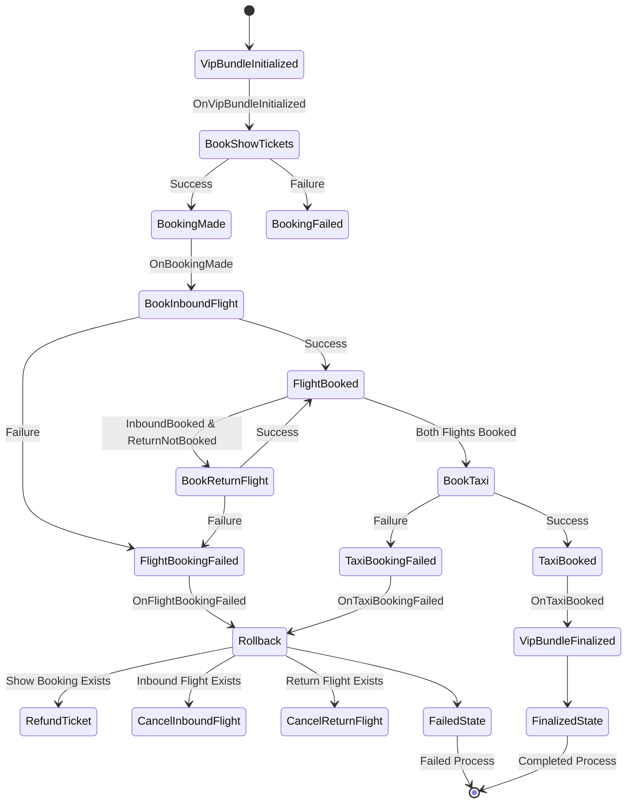

# Failed to Book Return Flight Ticket

In this exercise, it won't be possible to book **return flight** tickets (previously, it was inbound flight tickets).
`FlightBookingFailed_v1` should be already properly emitted (you did this in the previous exercise).
We will also refund tickets, but we are missing the command handler for handling the inbound flight ticket, which was already booked.



## Exercise

File: `project/main.go`

Implement the `CancelFlightTickets` command handler.

It should call `DeleteFlightTicketsTicketIdWithResponse` for **each** ticket ID.

```go
resp, err := t.clients.Transportation.DeleteFlightTicketsTicketIdWithResponse(ctx, ticketID)
if err != nil {
	return fmt.Errorf("failed to cancel flight tickets: %w", err)
}
```

`CancelFlightTickets` should already be published for inbound tickets by your process manager.
**You should keep the original functionality, and show tickets should be canceled as well.**

