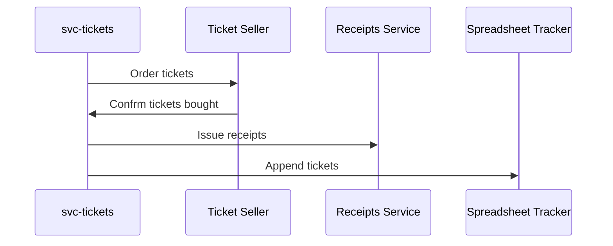

# Project: Introduce asynchronous calls


<div class="alert alert-dismissible bg-light-primary d-flex flex-column flex-sm-row p-7 mb-10">
    <div class="d-flex flex-column">
        <h3 class="mb-5 text-dark">
			<svg xmlns="http://www.w3.org/2000/svg" width="16" height="16" fill="currentColor" class="bi bi-lightbulb text-primary" viewBox="0 0 16 16">
			  <path d="M2 6a6 6 0 1 1 10.174 4.31c-.203.196-.359.4-.453.619l-.762 1.769A.5.5 0 0 1 10.5 13a.5.5 0 0 1 0 1 .5.5 0 0 1 0 1l-.224.447a1 1 0 0 1-.894.553H6.618a1 1 0 0 1-.894-.553L5.5 15a.5.5 0 0 1 0-1 .5.5 0 0 1 0-1 .5.5 0 0 1-.46-.302l-.761-1.77a1.964 1.964 0 0 0-.453-.618A5.984 5.984 0 0 1 2 6zm6-5a5 5 0 0 0-3.479 8.592c.263.254.514.564.676.941L5.83 12h4.342l.632-1.467c.162-.377.413-.687.676-.941A5 5 0 0 0 8 1z"/>
			</svg>
			Tip
		</h3>
        <span>
Project files stay in the same "project" directory across all exercises.
</span>
	</div>
	</div>

Here's how our integration with the external ticketing systems works.

When the user chooses tickets and pays for the order, we call the ticketing system.
However, the API works in an asynchronous way. We don't receive a response immediately; instead, a webhook is called with the order status.

If the ticket purchase is confirmed, we perform two actions for each ticket:

1. Issue a receipt for the client using a third-party tool.
2. Add it to a "tracker" spreadsheet, so our team can print the physical copy and send it to the customer.



The spreadsheet integration is not the best possible experience, of course, but that's where the company is at the moment.


<div class="alert alert-dismissible bg-info text-white d-flex flex-column flex-sm-row p-7 mb-10">
    <div class="d-flex flex-column">
        <h3 class="mb-5 text-white">
			Background	
		</h3>
        <span>

We have a ton of orders every day, and the receipts and spreadsheet APIs are not super-reliable: They sometime fail
for unknown reasons. If this happens, we end up with no tickets printed and delivered (meaning angry customers) or
no receipts issued (meaning an angry accounting team). We call both APIs for each ticket, so the worst outcome occurs when
someone orders in bulk: If something goes wrong, some tickets are entirely skipped on both systems.

</span>
	</div>
	</div>

It's fine if the receipt is delivered a few minutes after the purchase. Likewise, the ticket row can be populated into the spreadsheet
a bit later. However, it's important that both eventually happen.

## Background Workers

Let's consider a more advanced take on jobs running in the background. Thanks to Go's concurrency model, we can
create a worker process that asynchronously handles the API calls.

First, let's define a `Message` struct that we'll pass to let the worker know what to do.
Each message consists of a task and a ticket ID; the task is a simple enum.

```go
type Task int
const (
	TaskIssueReceipt Task = iota
	TaskAppendToTracker
)

type Message struct {
	Task     Task
	TicketID string
}
```

An example worker implementation could look like this:

```go
type Worker struct {
	queue chan Message
}

func NewWorker() *Worker {
	return &Worker{
		queue: make(chan Message, 100),
	}
}
```

The key part of the worker is the queue, which is a channel of messages. It's important to set the buffer
size so that the worker can accept new messages while it's busy processing other ones.

The `Send` method just pushes the given messages to the queue.

```go
func (w *Worker) Send(msg ...Message) {
	for _, m := range msg {
		w.queue <- m
	}
}
```

The `Run` method is the main loop of the worker. It waits for new messages and processes them.

```go
func (w *Worker) Run() {
	for msg := range w.queue {
		switch msg.Task {
		case TaskIssueReceipt:
			// issue the receipt 
		case TaskAppendToTracker: 
			// append to the tracker spreadsheet
		}
	}
}
```

Using the Worker might look like this:

```go
w := NewWorker()
go w.Run()

w.Send(Message{
	Task:     TaskIssueReceipt, 
	TicketID: ticketID,
})
```

Note that `Run` is called in a separate goroutine.
Otherwise, it would block execution of the current function.

Similarly, `Send` is non-blocking, so it won't wait for the message to be processed.
It pushes the message to the queue and returns immediately.
The worker processes the message in the background.

## Exercise

File: `project/main.go`

Let's start by making sure that temporary errors don't interfere with our orders by implementing a worker process similar to the one above.

Move the logic from the HTTP handler to the worker's `Run` method.
Split it depending on the incoming task, so the proper service is called.

The HTTP handler should only send the messages for both tasks and have no other logic.
So for each ticket ID in the request, send two messages: one with `TaskIssueReceipt` and one with `TaskAppendToTracker`.

To make the worker retry failed messages, simply republish them using `Send` if an error happens.
The message will be added to the queue and processed later. This step is important so you don't lose messages while one of the APIs is down!

```go
if err != nil {
	w.Send(msg)	
}
```

Since the tasks are processed in the background, you don't want to use the request's context.
Otherwise, the requests would be canceled when the handler returns.
You need to replace the context passed to the API clients with `context.Background()`.


<div class="alert alert-dismissible bg-light-primary d-flex flex-column flex-sm-row p-7 mb-10">
    <div class="d-flex flex-column">
        <h3 class="mb-5 text-dark">
			<svg xmlns="http://www.w3.org/2000/svg" width="16" height="16" fill="currentColor" class="bi bi-lightbulb text-primary" viewBox="0 0 16 16">
			  <path d="M2 6a6 6 0 1 1 10.174 4.31c-.203.196-.359.4-.453.619l-.762 1.769A.5.5 0 0 1 10.5 13a.5.5 0 0 1 0 1 .5.5 0 0 1 0 1l-.224.447a1 1 0 0 1-.894.553H6.618a1 1 0 0 1-.894-.553L5.5 15a.5.5 0 0 1 0-1 .5.5 0 0 1 0-1 .5.5 0 0 1-.46-.302l-.761-1.77a1.964 1.964 0 0 0-.453-.618A5.984 5.984 0 0 1 2 6zm6-5a5 5 0 0 0-3.479 8.592c.263.254.514.564.676.941L5.83 12h4.342l.632-1.467c.162-.377.413-.687.676-.941A5 5 0 0 0 8 1z"/>
			</svg>
			Tip
		</h3>
        <span>

For this exercise, `receipts` service will return 500 errors for a while.
This is expected - you should let worker handle that and retry the request.

</span>
	</div>
	</div>
