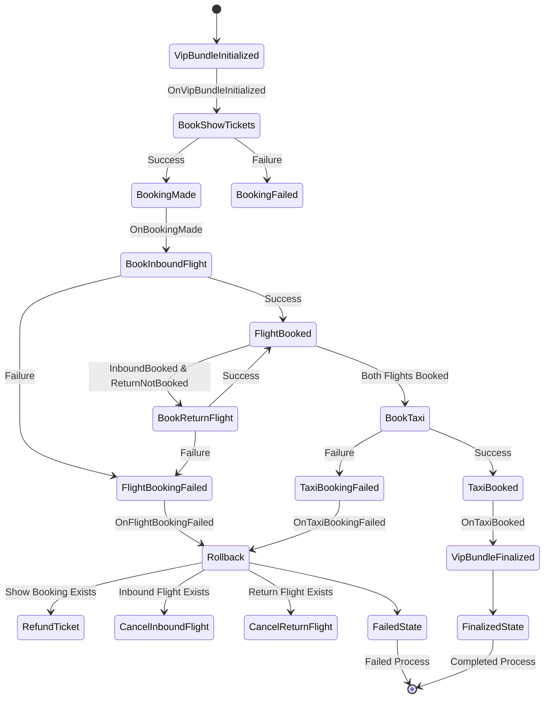

# Rollback of Show Tickets

It's time to take advantage of the main purpose for which we used the process manager: handling rollbacks.

Let's start with refunding tickets when we fail to book an inbound flight ticket.
In this exercise, our process will fail when we try to book an inbound flight ticket.
The API will return a 409 Conflict status code.

We should handle this error and emit `FlightBookingFailed_v1`.

In [12-cqrs-commands/03-project-handle-command](/trainings/go-event-driven/exercise/0a46c758-54e5-4be2-9349-3b32529eb9c6),
we already implemented the `RefundTicket` command handler.
If it's still working, it should work out of the box (this command should be emitted by our process manager).

## Exercise

File: `project/main.go`

Emit `FlightBookingFailed_v1` when we fail to book an inbound flight ticket.
