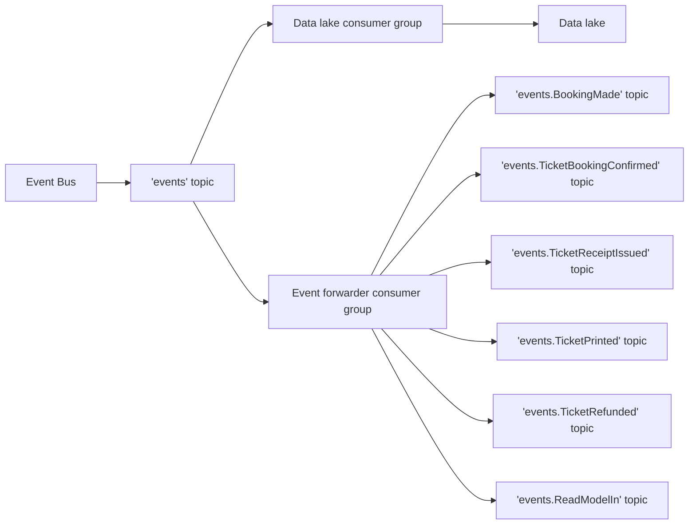

# Publish events to the `events` topic

We need to know what kinds of events we have in our system, so we can store them in our data lake.

There are two ways of doing that:

1. Having a registry of all events. **This is potentially error-prone.** 
   If you forget to add some event to this registry 
   and need to migrate a read model, you will be in trouble because you will miss the data.
   You can always try to reproduce the data from your write models, but it will be hard to do.
   For that reason, **we don't recommend this option.**
2. You can publish all events to a central topic (for example: `events`) and later 
   forward them to the data lake and per-event topics. 
   In other words, you will have two [consumer groups](/trainings/go-event-driven/exercise/f2eca145-e8cd-49c5-bdfa-384d33aa0bea): 
   one for forwarding events to the data lake and one for forwarding events to per-event topics.
   This approach ensures that there will be no way to miss any event.

We will go with option number two.



The forwarding part can be done via a separate service when it's done for multiple microservices.
However, it's also a good idea to do it within one service.
That's the strategy that we will follow.

## Exercise

File: `project/main.go`

Change the event bus configuration to publish all events to the `events` topic, and add a new [message handler](/trainings/go-event-driven/exercise/6e0ddff2-aaf9-4188-aeea-9fc8eb9ac6ba) 
in your message router that will forward all events to the `events.<event_name>` topic.

We want to use the message handler instead of the event processor because we don't want to unmarshal our events.
We are just forwarding them.

You can get the event name by using the CQRS marshaler.

```go
func(msg *message.Message) error {
   eventName := eventProcessorConfig.Marshaler.NameFromMessage(msg)
   if eventName == "" {
      return fmt.Errorf("cannot get event name from message")
   }
```


<div class="accordion" id="hints-accordion">

<div class="accordion-item">
	<h3 class="accordion-header" id="hints-accordion-header-1">
	<button class="accordion-button fs-4 fw-semibold collapsed" type="button" data-bs-toggle="collapse" data-bs-target="#hints-accordion-body-1" aria-expanded="false" aria-controls="hints-accordion">
		Hint #1
	</button>
	</h3>
	<div id="hints-accordion-body-1" class="accordion-collapse collapse" aria-labelledby="hints-accordion-header-1" data-bs-parent="#hints-accordion">
	<div class="accordion-body">

You should use `Marshaler` from your [event processor](/trainings/go-event-driven/exercise/7d5d32c0-772e-48f3-82a9-087a49e73931) config to get the event name from the message.
After that, you should publish the message to the `events.<event_name>` topic.

```go
router.AddNoPublisherHandler(
	"events_splitter",
	"events",
	redisSubscriber,
	func(msg *message.Message) error {
		eventName := eventProcessorConfig.Marshaler.NameFromMessage(msg)
		if eventName == "" {
			return fmt.Errorf("cannot get event name from message")
		}

		return redisPublisher.Publish("events."+eventName, msg)
	},
)
```

We are using `AddNoPublisherHandler` because we need to dynamically choose the topic name.

</div>
	</div>
	</div>

</div>

