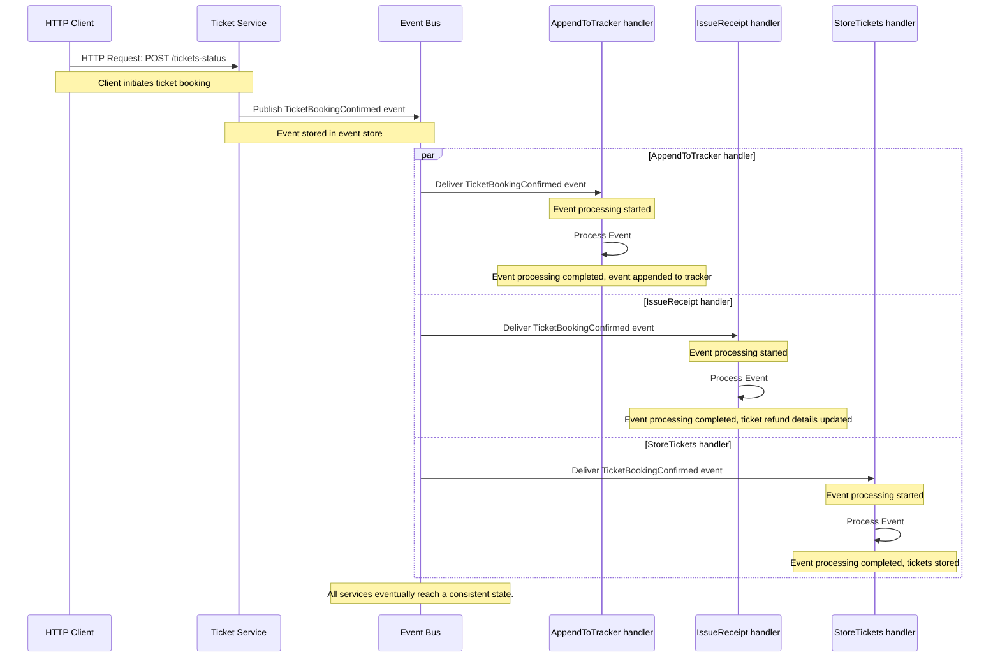

# Storing tickets

We know how to connect to the database, and our schema is ready, so it's time to store tickets in the database!

### Eventual consistency

We mentioned in the previous exercise's _Background_ that the endpoint can be _eventually consistent_. What does that mean?

Eventual consistency is a model used in distributed systems in which we sacrifice immediate consistency for availability and partition tolerance.
That sounds a bit like a definition from encyclopedia, so let's try to explain it in a more practical way.

In our application, we are publishing the `TicketBookingConfirmed` event in the scope of HTTP request, but everything else is done asynchronously.
Thanks to that, the HTTP request won't fail if any of the handlers is not working properly.
However, it has one trade-off: We can't guarantee that all event handlers will be executed immediately.
They will be executed _eventually_, at some point of time. If some transient error occurs, they will succeed once the error is resolved.

There could be a problem if you have an API that allows you to create and get some resource, and it's used by the application frontend.
In that scenario, if handlers are not fast enough to process the event, the frontend may not be able to get the resource that was just created.
In other words, the frontend may be faster in calling the HTTP API to get the new resource than the event handlers are in processing the event.

In such scenarios, you may not want to process your API request asynchronously.
Fortunately for us, we don't have such a requirement in our project.

    

        <h3 class="mb-5 text-dark">
			<svg xmlns="http://www.w3.org/2000/svg" width="16" height="16" fill="currentColor" class="bi bi-lightbulb text-primary" viewBox="0 0 16 16">
			  <path d="M2 6a6 6 0 1 1 10.174 4.31c-.203.196-.359.4-.453.619l-.762 1.769A.5.5 0 0 1 10.5 13a.5.5 0 0 1 0 1 .5.5 0 0 1 0 1l-.224.447a1 1 0 0 1-.894.553H6.618a1 1 0 0 1-.894-.553L5.5 15a.5.5 0 0 1 0-1 .5.5 0 0 1 0-1 .5.5 0 0 1-.46-.302l-.761-1.77a1.964 1.964 0 0 0-.453-.618A5.984 5.984 0 0 1 2 6zm6-5a5 5 0 0 0-3.479 8.592c.263.254.514.564.676.941L5.83 12h4.342l.632-1.467c.162-.377.413-.687.676-.941A5 5 0 0 0 8 1z"/>
			</svg>
			Tip
		</h3>
        

If you are in a situation where you can't process your HTTP request synchronously, and you want to show 
it on the frontend properly, you still have some strategies to handle request asynchronously and show the result on the frontend:

1. Do only dummy polling of the endpoint every X seconds until you get the result. This is not very efficient, but it's simple to implement and may be good enough.
2. Use Server-Sent Events (SSE) or WebSockets to push the result to the frontend. This approach is more efficient, but it's more complex to implement. 

SSE is beyond the scope of this training, but we prepared an [example of how to use it with Watermill](https://github.com/ThreeDotsLabs/watermill/tree/master/_examples/real-world-examples/server-sent-events/).

	

	

**When you are designing your system, you need to think about the trade-off between consistency and availability.
There is no silver bullet: You need to decide which is more important for your system.**
If your handlers are potentially fragile or slow (because of external dependencies), you may want to process your requests asynchronously.
If you need your system to have a consistent state, you may want to process your requests synchronously.

In some cases it may be useful to store some data synchronously and later do some additional processing asynchronously.
We will cover such scenarios in the next module.

## Exercise

File: `project/main.go`

Add a new event handler that will store tickets in the database when a `TicketBookingConfirmed` event is received.

It's up to you how you store the tickets. **It's just important to store them in the `tickets` table** created in the previous exercise.

We recommend using the _Repository Pattern_ to store the tickets.
It will make your code more testable (and it will be useful very soon).
If you are looking for inspiration on how to do that, check our [blog post about the Repository Pattern](https://threedots.tech/post/repository-pattern-in-go/).

    

        <h3 class="mb-5 text-dark">
			<svg xmlns="http://www.w3.org/2000/svg" width="16" height="16" fill="currentColor" class="bi bi-lightbulb text-primary" viewBox="0 0 16 16">
			  <path d="M2 6a6 6 0 1 1 10.174 4.31c-.203.196-.359.4-.453.619l-.762 1.769A.5.5 0 0 1 10.5 13a.5.5 0 0 1 0 1 .5.5 0 0 1 0 1l-.224.447a1 1 0 0 1-.894.553H6.618a1 1 0 0 1-.894-.553L5.5 15a.5.5 0 0 1 0-1 .5.5 0 0 1 0-1 .5.5 0 0 1-.46-.302l-.761-1.77a1.964 1.964 0 0 0-.453-.618A5.984 5.984 0 0 1 2 6zm6-5a5 5 0 0 0-3.479 8.592c.263.254.514.564.676.941L5.83 12h4.342l.632-1.467c.162-.377.413-.687.676-.941A5 5 0 0 0 8 1z"/>
			</svg>
			Tip
		</h3>
        

During the implementation, note how simple it is to add a new event handler; this is thanks to decoupling handler logic from the publisher.
You can implement handlers within the same service, but it can also be handlers in different microservices.

This decoupling has a price: You need to keep your events backward-compatible.
The ease of adding new handlers carries with it one risk in that you can end up with a lot of handlers that you need to maintain.

It still a good trade-off if you want to keep your system decoupled, more scalable, and extensible, 
but don't forget to be pragmatic and not make your system too granular.

In our project, we may do some over-engineering for the sake of learning, but in real life, you should always think about the trade-off between complexity and benefits.

	

	

